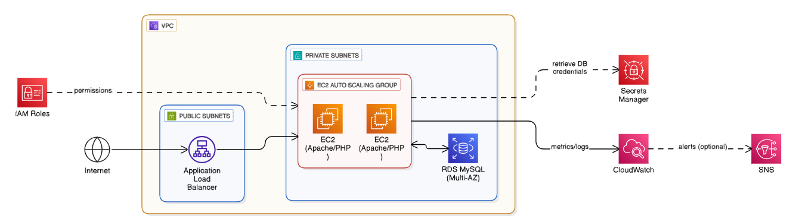

# Scalable Web Application with ALB, Auto Scaling, and RDS

This project demonstrates a **secure, highly available, and scalable PHP web application** deployed on AWS. It uses EC2 instances in **private subnets** behind an Application Load Balancer (ALB), an Auto Scaling Group (ASG), and a Multi-AZ RDS MySQL database for backend storage. Database credentials are securely stored in **Secrets Manager**.


---

---

## Architecture Overview

This infrastructure includes:

1. **VPC & Subnets**  
   - **Public subnets** → ALB, internet-facing.  
   - **Private subnets** → EC2 application servers, isolated from direct internet access.  
   - **Private subnets** → RDS database for enhanced security.

2. **EC2 Auto Scaling Group**  
   - Launches EC2 instances automatically in private subnets.  
   - Auto Scaling adjusts the number of instances based on demand.  

3. **Application Load Balancer (ALB)**  
   - Public-facing load balancer distributes incoming HTTP traffic to private EC2 instances.  
   - Health checks ensure traffic is routed only to healthy instances.

4. **Amazon RDS (Multi-AZ)**  
   - MySQL database in private subnets.  
   - Multi-AZ deployment ensures high availability.  
   - EC2 instances connect securely via a security group.

5. **Secrets Manager**  
   - Stores database credentials securely.  
   - EC2 instances fetch credentials dynamically on startup.  

6. **IAM Roles & Security**  
   - EC2 instances have an IAM role to access Secrets Manager and CloudWatch.  
   - Security groups ensure ALB → EC2 → RDS traffic flow.  

---

## Web Application

The PHP application (`index.php`) deployed on EC2:

- Connects to the RDS database using credentials from Secrets Manager.  
- Creates a `visitors` table if it does not exist.  
- Logs each page visit.  
- Displays total visits and the hostname of the serving EC2 instance.  

This allows you to **observe load balancing**, as multiple EC2 instances increment visitor counts independently.

You can optionally run the PHP app locally for quick testing:

```bash
php -S localhost:8080 -t app/
# Open http://localhost:8080 in your browser
```
---
### Deployment
Deploy the infrastructure using the provided CloudFormation template:
```bash
pip install -r requirements.txt        # Install Python dependencies
cfn-lint infrastructure.yaml          # Validate the template
aws cloudformation deploy \
    --template-file infrastructure.yaml \
    --stack-name scalable-web-app \
    --capabilities CAPABILITY_IAM \
    --parameter-overrides KeyName=YOUR_KEY
```
---
### Notes

- EC2 instances run Amazon Linux 2 with Apache and PHP installed via user data.

- Instances reside in private subnets for enhanced security.

- Auto Scaling ensures high availability and scales EC2 instances based on demand.

- RDS is deployed in Multi-AZ mode for resilience.

- The PHP app retrieves database credentials securely from Secrets Manager.

- The ALB in public subnets exposes the application safely without exposing EC2 directly.

- For production, PHP code can be deployed from S3 or Git, allowing updates without modifying the template.
---
### License

MIT
